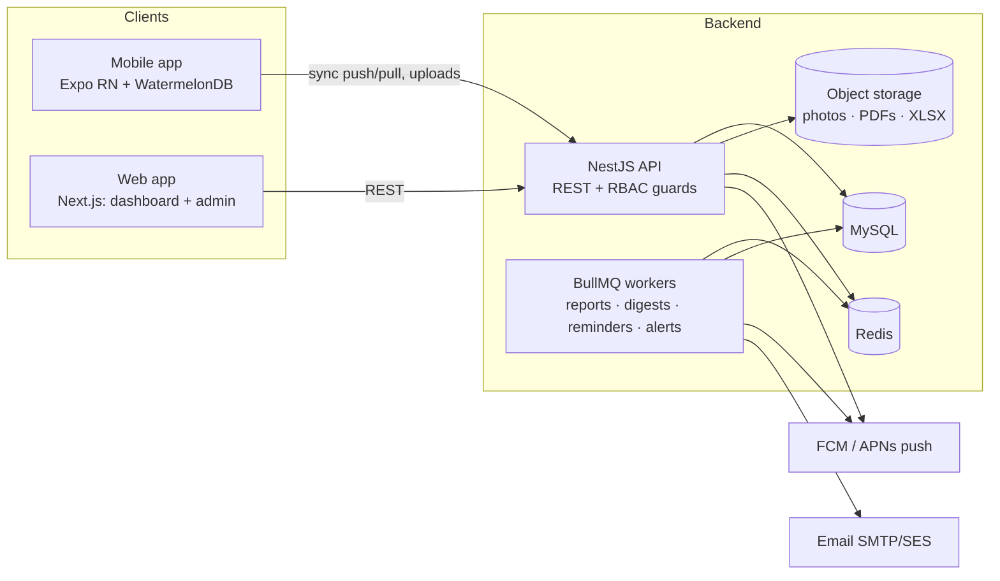

# Drillex Ops — Development Plan

Source: *DrillexOps App Requirements Blueprint v1.0 (May 2026)*. This plan turns the SRS into an architecture, a repo layout, a data model, and a phased build schedule for a React Native mobile app, a web app (manager dashboard + admin portal), and the backend that serves both.

---

## 1. What we are building

| Surface | Who uses it | Tech |
|---|---|---|
| **Mobile app** (Android primary, iOS, Android tablets) | Operators, drillers, technicians, supervisors | React Native (Expo SDK 52+, TypeScript), offline-first |
| **Web app** (single site, role-filtered) | Managers, admins, supervisors | Next.js 15 (App Router), TypeScript, Tailwind + shadcn/ui |
| **Backend API** | Both clients | NestJS (TypeScript), MySQL 8, Prisma, Redis, BullMQ, S3-compatible object storage |
| **Shared packages** | All TS code | Zod schemas, TS types, RBAC permission matrix, calc helpers |

Yes — a separate **admin portal** is required (SRS 9.1 "Admin web dashboard", 10.1 User Management / Asset Register / Reports), and a **backend** is required (RBAC at API level, offline sync, scheduled reports, push notifications, audit trail). The admin portal and manager dashboard are one Next.js site with role-gated sections, not two sites.

### Stack rationale (decisions, not options)
- **Expo + RN** — one codebase for phone/tablet/iOS; EAS Build/Update for OTA fixes; `expo-local-authentication` (biometrics), `expo-camera`, `expo-location`, `expo-notifications`, `expo-secure-store`.
- **Local DB: WatermelonDB** (SQLite) — built for offline-first RN with sync protocol; SQLCipher-encrypted at rest (AES-256 requirement).
- **NestJS** — modular, decorator-based guards make RBAC at API level explicit; first-class BullMQ integration for jobs (monthly reports, digests, reminders).
- **MySQL + Prisma** — relational data (assets ↔ schedules ↔ job cards ↔ parts); Prisma shares types with `packages/shared`. Append-only `audit_log` table.
- **Next.js** — same TS/Zod schemas as mobile; server components for report pages; export PDFs via headless Chromium (Playwright) on the API, Excel via `exceljs`.
- **Auth: self-hosted** (employee ID + password, Argon2id, JWT access 15 min + refresh rotation, TOTP 2FA for Manager/Admin). No shared logins; device ID captured on every login.
- **Infra** — Docker images; deploy API + web to a single cloud (Fly.io/Render/AWS ECS — decide in Phase 0), managed MySQL, Redis, S3/R2 for photos & report files. GitHub Actions CI, EAS for mobile builds.

---

## 2. System architecture



**Key flows**
- **Sync**: mobile pushes changed rows (`/sync/push`) and pulls changes since `last_pulled_at` (`/sync/pull`) per WatermelonDB protocol. Server applies server-side validation & RBAC on push; conflicting edits (same record, two devices, both offline) create a `sync_conflict` row for supervisor review instead of last-write-wins.
- **Uploads**: photos saved locally, queued, uploaded via presigned URLs when online; records reference upload IDs.
- **Alerts**: daily-reading triggers (warning lights / leaks / noises = YES, condition ≤ 2) and job-card opening (asset → Under Maintenance) are evaluated in the API on write, then fan out to push + in-app notifications via a queue.
- **Scheduled jobs**: maintenance reminders (lead time), overdue flags, weekly manager digest, daily supervisor digest email, month-end report compilation, low-stock alerts.

---

## 3. Monorepo layout

```
drillex/
├─ apps/
│  ├─ mobile/          # Expo RN app
│  ├─ web/             # Next.js dashboard + admin
│  └─ api/             # NestJS API + workers
├─ packages/
│  ├─ shared/          # Zod schemas, types, enums, RBAC matrix, calc helpers
│  ├─ ui/              # (optional) shared web components
│  └─ config/          # eslint, tsconfig, prettier presets
├─ infra/              # docker-compose (pg, redis, minio), deploy manifests
├─ docs/               # this plan, ADRs, API docs
└─ turbo.json, pnpm-workspace.yaml
```

Tooling: pnpm workspaces + Turborepo, TypeScript strict everywhere, Vitest (unit), Playwright (web e2e), Maestro (mobile e2e), Prisma migrations, OpenAPI generated from Nest decorators → typed client in `packages/shared`.

---

## 4. Data model (core entities)

| Entity | Key fields | Notes |
|---|---|---|
| `users` | employee_id (unique), name, role, site_id, password_hash, totp_secret, status | Roles: OPERATOR, TECHNICIAN, SUPERVISOR, MANAGER, ADMIN |
| `devices` | user_id, device_id, platform, approved, last_seen | Optional device registration |
| `login_events` | user_id, device_id, success, ip, ts | SRS 2.2 |
| `sites` | name, geo | Dropdown/GPS source |
| `assets` | asset_number (immutable, unique), name, category, make, model, serial, year, commissioned_at, site_id, status, notes | Photos in `attachments` |
| `asset_operators` | asset_id, user_id, valid_from/to | Enforces "only assigned operator submits" |
| `shift_reports` | asset_id, user_id, date, shift, site_id, production fields, downtime, status (SUBMITTED/APPROVED/UNLOCKED), signature_id, submitted_at, approved_by | total_meters computed server-side |
| `shift_report_chemicals` | shift_report_id, chemical_id, qty, uom, purpose, stock_on_hand | multi-row |
| `chemicals` | name, default_uom, unit_cost, budget | Master list; cost for Chemical Usage report |
| `daily_readings` | asset_id, user_id, date, hour_meter, fuel_start/end, fluid levels, tyre_pressures (jsonb), flags, condition_rating, notes, signature_id | Unique (asset, date) |
| `maintenance_schedules` | asset_id, service_type, description, interval_hours/days, last_service_at, last_service_hours, next_due_at, next_due_hours, lead_time, status, est_downtime, notes | One schedule *set* per asset, many rows |
| `maintenance_schedule_parts` | schedule_id, part_id, qty | |
| `job_cards` | job_no (auto), asset_id, date, job_type, reported_fault, work_performed, hour_meter, labour_hours, tools, cond_before/after, test_result, next_action, status, tech_signature_id, approved_by | |
| `job_card_technicians`, `job_card_parts` | | parts deduct inventory |
| `parts`, `part_stock_movements` | part_no, name, qty_on_hand, min_qty, unit_cost; movement type (IN/OUT/ADJUST) | Low-stock alerts |
| `attachments` | owner_type, owner_id, storage_key, kind (photo/doc/signature) | Presigned upload |
| `notifications` | user_id, type, payload, read_at | In-app centre |
| `alerts` | asset_id, source, severity, resolved_at | Asset Health report |
| `reports` | type, period_start/end, generated_at, pdf_key, xlsx_key, generated_by | 24-month archive |
| `audit_log` | actor_id, device_id, entity, entity_id, action, diff (jsonb), ts | Append-only, every write |
| `sync_conflicts` | entity, entity_id, versions (jsonb), resolved_by | Supervisor review |

All syncable tables carry `id (uuid)`, `created_at`, `updated_at`, `deleted_at`, `_status` for WatermelonDB.

---

## 5. Module map (SRS section → deliverables)

| SRS | Module | Mobile | Web | API |
|---|---|---|---|---|
| 2 | Auth & RBAC | Login, biometric unlock, 15-min idle lock, 2FA for mgr/admin | Login, 2FA, session mgmt | JWT, refresh rotation, TOTP, role guards, login_events |
| 3 | Asset Register | Read-only profile + history (supervisor) | CRUD, photos, operator assignment | Immutable asset_number generator `DRL-001`/`EQP-045` |
| 4 | Shift Production | Form w/ chemical rows, signature, offline queue, history | Review/approve, unlock w/ reason | Validation (end ≥ start), compute totals, approval workflow, audit |
| 5 | Daily Readings | Form, photos, signature, tyre grid, history | Supervisor dashboard w/ red thresholds | Unique/day, alert triggers, threshold config |
| 6 | Maintenance Schedule | Per-asset list, due/overdue, mark done | CRUD schedules, fleet calendar | Due calc from hour meter & dates, reminder jobs, status = Under Maintenance on job open |
| 7 | Job Cards + Parts | Create/complete, parts rows, before/after photos, sign-off | Approve, parts inventory, purchase requests | Job numbering, stock deduction, low-stock alerts, Awaiting Parts hold |
| 8 | Reports | View/share PDFs | Generate, custom ranges, export PDF/XLSX, email | 7 report builders, month-end job, archive |
| 9 | NFRs | Offline sync, sync indicator, encryption, push | Notification centre | Audit log, TLS 1.3, rate limits, 200 concurrent users |
| 10 | Navigation | Tab nav per role | Sidebar per role | — |

---

## 6. Cross-cutting designs

**RBAC** — a single permission matrix in `packages/shared/rbac.ts` (e.g. `shift_report:create` → OPERATOR on own assigned asset; `shift_report:approve` → SUPERVISOR same site, MANAGER all). Enforced by Nest guards + row-level scoping (site/asset/self); the same matrix hides UI in both clients.

**Offline** — *(Decision 2026-08-21: implemented as an outbox queue instead of WatermelonDB — our records are append-only submissions, so a client-UUID outbox + idempotent `/sync/push` gives the same SRS guarantees with no native DB setup; WatermelonDB remains the upgrade path if bidirectional offline editing is ever needed.)* Every form writes to the local outbox first; a background sync task runs on connectivity change and app foreground; header badge shows *Synced / Pending (n) / Conflict*. Submission is "final" locally (read-only) but stays pending until the server acks. Server rejects invalid rows and returns per-row errors which the app surfaces.

**Signatures** — captured as PNG via `react-native-signature-canvas`, stored as attachments, hashed into the audit record.

**Audit** — Prisma middleware writes `audit_log` for every create/update/delete with actor, device and JSON diff; approvals and unlocks are explicit audit actions.

**Notifications** — Expo push tokens per device; types: maintenance_due, overdue_submission, approval_required, machine_alert, report_ready, low_stock. Daily digest email (supervisor/manager), weekly maintenance digest (manager).

**Reports** — builders read from MySQL views/materialised summaries; render HTML → PDF (Playwright) and XLSX (exceljs); stored in object storage; emailable from the app.

---

## 7. Phased plan (≈ 6 months)

| Phase | Weeks | Scope | Exit criteria |
|---|---|---|---|
| **0 — Foundation** | 1–2 | Monorepo, CI, docker-compose, Prisma schema v1, auth (login/JWT/2FA), RBAC matrix, design system (mobile + web), EAS setup | Both apps log in against the API; seed data; pipeline green |
| **1 — Core** | 3–8 | Asset Register (web CRUD, mobile view), Daily Readings (mobile form + sync + alerts, web review dashboard), Shift Production (form, chemicals, signature, approval/unlock), offline sync v1, audit log, notification centre | Pilot site can run a full day offline and sync; supervisors approve on web |
| **2 — Maintenance** | 9–16 | Maintenance schedules + reminders, Job Cards (mobile/web), Parts Inventory + low-stock, status automation, push notifications, technician flows | A breakdown → job card → parts → approval loop works end-to-end |
| **3 — Reporting** | 17–20 | 7 report builders, month-end job, PDF/XLSX export, email share, custom ranges, manager dashboard analytics, 24-month archive | Month-end reports auto-generated and downloadable |
| **4 — Advanced** | 21–26+ | Conflict-review UI, device registration, MDM hooks, digests, web admin polish, performance/load test (200 users), store release, integrations API | Production release; SLA monitoring live |

Each phase ends with a UAT on a real site with the stakeholder group and a go/no-go.

---

## 8. Team & effort (suggested)

| Role | Count | Notes |
|---|---|---|
| Tech lead / architect | 1 | Owns schema, sync, RBAC |
| RN mobile dev | 2 | |
| Full-stack (Nest + Next) | 2 | |
| UI/UX designer | 1 (part-time after Phase 1) | Field-first, tablet layouts |
| QA | 1 | Maestro/Playwright, offline test matrix |
| DevOps | shared / part-time | |

---

## 9. Risks & mitigations

| Risk | Mitigation |
|---|---|
| Offline sync complexity | Use WatermelonDB's proven protocol; keep server authoritative; conflict table instead of clever merges; test with airplane-mode matrix from Phase 1 |
| Weak connectivity on site uploading photos | Compress client-side, background upload queue, cap 5/10 photos per SRS |
| RBAC drift between clients | Single shared matrix + contract tests |
| Report performance month-end | Materialised daily summaries; generate in worker, not request path |
| App store review timelines | Start TestFlight/Internal testing in Phase 1; distribute via EAS internal builds during pilot |

---

## 10. Open questions for stakeholders

1. Hosting preference/region and data residency (cloud account ownership)?
2. Email/SMS provider and push certificates (Apple Developer & Google Play accounts)?
3. Chemical and parts master lists + unit costs / budgets for variance reporting?
4. "Acceptable thresholds" for daily-reading red highlights — per asset category?
5. Is MDM/device registration in scope for v1 or Phase 4 only?
6. Approval: must every shift report be approved before it counts in reports?
7. Languages/locales and units (metric assumed).

---

## 11. Immediate next steps

1. Approve stack & phase plan.
2. Bootstrap monorepo (`pnpm`, Turborepo, Expo app, Next app, Nest app, Prisma).
3. Write Prisma schema v1 from §4 and the RBAC matrix from §6.
4. Produce low-fi screens for Daily Readings & Shift Production (the two highest-volume forms).
5. Set up CI + docker-compose and a staging environment.

---

## 12. Approximate budget

All figures are **rough order-of-magnitude estimates in USD**, based on the team in §8 working the 26-week plan in §7 (≈ 177 person-weeks, 40 h/week). Rates are blended market rates; adjust to your actual vendors/locations.

### 12.1 Build cost — two team-rate scenarios

| Role | Person-weeks | Scenario A: offshore / India–SEA team | Scenario B: onshore / boutique agency |
|---|---|---|---|
| Tech lead / architect | 26 | $60/h → $62,400 | $140/h → $145,600 |
| RN mobile devs (2) | 52 | $40/h → $83,200 | $110/h → $228,800 |
| Full-stack devs (2) | 52 | $40/h → $83,200 | $110/h → $228,800 |
| UI/UX designer | 16 | $35/h → $22,400 | $100/h → $64,000 |
| QA | 24 | $30/h → $28,800 | $80/h → $76,800 |
| DevOps (≈ 0.25 FTE) | 7 | $50/h → $14,000 | $130/h → $36,400 |
| PM / BA (0.5 FTE) | 13 | $45/h → $23,400 | $110/h → $57,200 |
| **Subtotal** | **190** | **≈ $317,000** | **≈ $838,000** |
| Contingency 15 % | | ≈ $48,000 | ≈ $126,000 |
| **Total build** | | **≈ $365,000** | **≈ $964,000** |

A lean variant (1 RN dev + 1 full-stack + lead, ~9 months) would land around **$200–240k (A)** / **$550–650k (B)** but stretches the timeline to ~36 weeks.

### 12.2 Build cost by phase (Scenario A / B)

| Phase | Weeks | Share | Scenario A | Scenario B |
|---|---|---|---|---|
| 0 — Foundation | 2 | 8 % | ≈ $28k | ≈ $74k |
| 1 — Core | 6 | 23 % | ≈ $84k | ≈ $222k |
| 2 — Maintenance | 8 | 31 % | ≈ $113k | ≈ $299k |
| 3 — Reporting | 4 | 15 % | ≈ $56k | ≈ $148k |
| 4 — Advanced & release | 6 | 23 % | ≈ $84k | ≈ $222k |

### 12.3 One-off & running costs (independent of team rates)

| Item | Cost |
|---|---|
| Apple Developer Program | $99 / year |
| Google Play developer account | $25 once |
| Cloud hosting (API + web, managed MySQL, Redis, object storage, staging + prod) | $400 – 900 / month |
| Expo EAS (builds + OTA updates) | $0 – 99 / month (Production plan ≈ $99) |
| Transactional email (SES / Postmark) | $20 – 50 / month |
| Push (FCM / APNs) | free |
| Monitoring & errors (Sentry, uptime) | $30 – 80 / month |
| Domain, DNS, TLS | ≈ $50 / year |
| Load-testing / security review (pre-release) | $3k – 10k one-off |
| **Running total** | **≈ $6k – 14k / year** |

### 12.4 After launch

- Support & maintenance (bug fixes, OS/store updates, small enhancements): budget **15–20 % of build cost per year** (≈ $55–75k/yr for A, ≈ $145–190k/yr for B), or a 1-dev retainer.
- Optional: MDM licences (if device registration/remote wipe is adopted) ≈ $3–8 per device per month.

### 12.5 Assumptions

- Metric units, English only; one production environment + one staging.
- No third-party ERP/accounting integrations in v1 (Phase 4 "API integrations" scoped as webhooks only).
- Stakeholders supply master data (assets, chemicals, parts) and are available for UAT at each phase gate.
- Hardware (tablets, phones) is **not** included.

---

## 13. Build status (as of 2026-08-21)

All ten implementation steps delivered in the initial build: foundation & auth (incl. 2FA, password reset, idle lock/biometrics), asset register, daily readings with alerts, shift production with approval/unlock, offline outbox sync + attachments/signatures/photos, maintenance schedules with reminders/digest, job cards with parts deduction and asset-status automation, parts inventory + purchase requests + push transport + notification centres, seven reports (PDF/XLSX, archive, email, month-end cron), and release hardening (device registration, integration tests in CI, load-test script, prod config guards, signing config).

Open items needing client inputs: Firebase/APNs credentials for native push, SMTP and S3 credentials, production hosting, real chemical/parts master data with costs & budgets, store listings.
